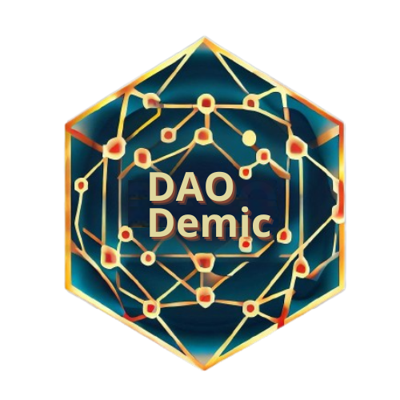

<div align="center">
 


  <DAODemic>
  
  <p>
    An awesome README template for your projects! 
  </p>
  
  
<!-- Badges -->
<p>
  <a href="https://github.com/Louis3797/awesome-readme-template/graphs/contributors">
    
  </a>
  <a href="">
    
  </a>
  <a href="https://github.com/Louis3797/awesome-readme-template/network/members">
    
  </a>
  <a href="https://github.com/Louis3797/awesome-readme-template/stargazers">
    
  </a>
  <a href="https://github.com/Louis3797/awesome-readme-template/issues/">
    
  </a>
  <a href="https://github.com/Louis3797/awesome-readme-template/blob/master/LICENSE">
    
  </a>
</p>
   
<h4>
    <a href="https://github.com/Louis3797/awesome-readme-template/">View Demo</a>
  <span> · </span>
    <a href="https://github.com/Louis3797/awesome-readme-template">Documentation</a>
  <span> · </span>
    <a href="https://github.com/Louis3797/awesome-readme-template/issues/">Report Bug</a>
  <span> · </span>
    <a href="https://github.com/Louis3797/awesome-readme-template/issues/">Request Feature</a>
  </h4>
</div>

<br />

<!-- Table of Contents -->
# :notebook_with_decorative_cover: Table of Contents

- [About the Project](#star2-about-the-project)
  * [Problem](#bomb-Problem)
  * [Solution](#woman_technologist-Solution)
  * [Deployed Dapp URL](#link-Deployed-Dapp-URL)
  * [Screenshots](#camera-screenshots)
  * [Tech Stack](#space_invader-tech-stack)
  * [Features](#dart-features)
  * [Color Reference](#art-color-reference)
  * [Environment Variables](#key-environment-variables)
- [Getting Started](#toolbox-getting-started)
  * [Prerequisites](#bangbang-prerequisites)
  * [Installation](#gear-installation)
  * [Run Locally](#running-run-locally)
  * [Deployment](#triangular_flag_on_post-deployment)
  * [Smart Contract](#exploding_head-Smart-Contracts)
- [Roadmap](#compass-roadmap)
- [Team](#wave-Team)
- [Contact](#handshake-contact)
- [Useful Links](#link-Useful-Links)
  * [DAODemic Whitepaper](#scroll-ESGROW-Whitepaper)
  * [Demo](#cinema-Demo)
- [Acknowledgments](#gem-Acknowledgements)

  

<!-- About the Project -->
## :star2: About the Project
**DAODemic** is a revolutionary platform that bridges the gap between sponsors and students within a dynamic decentralized autonomous organization (DAO). Our primary objective is to foster meaningful connections and mutual benefits by incentivizing active student participation in various community activities. Through our ecosystem, sponsors can reward dedicated students with exclusive vouchers to attend events, conferences, Internship Opportunities, Mentorship Programs, Access to Tools and Resources. We aim to create a vibrant community where students thrive and sponsors find potential talents, making education a rewarding journey for all.


<!-- Problem -->
## :bomb: Problem
**Sponsors: They need/want someone to solve/contribute in their project(s) in many different ways:**

1. Market Research
2. Community Engagement
3. Social Media Management
4. User Experience (UX) and User Interface (UI) Design
5. Content Creation
6. Event Planning and Organization
7. Data Analysis
8. Translation and Localization
9. Bug Testing and Quality Assurance
10. Educational Content Creation


<!-- Solution -->
## :woman_technologist: Solution

**Students: They can help/support sponsors with the below missions:** 

1. **Market Research:** Students can conduct market research to identify new trends, opportunities, and customer preferences in the web3 space. This valuable data can help sponsors refine their strategies and make informed business decisions.
2. **Community Engagement:** Students can actively engage with the sponsor's community, participate in discussions, and provide valuable feedback. Their fresh perspective and enthusiasm can foster a stronger sense of community and loyalty among users.
3. **Social Media Management:** Students can manage social media channels, create engaging content, and implement social media campaigns to increase brand awareness and drive user engagement.
4. **User Experience (UX) and User Interface (UI) Design:** Students skilled in UX/UI design can help improve the sponsor's website or application, making it more user-friendly and visually appealing.
5. **Content Creation:** Beyond written content, students can create multimedia content such as videos, infographics, and animations to enhance the sponsor's marketing efforts and educational materials.
6. **Event Planning and Organization:** Students can assist in organizing webinars, workshops, and conferences, helping sponsors create valuable networking opportunities and educational events.
7. **Data Analysis:** Students proficient in data analysis can help sponsors gather and analyze data to gain insights into user behavior, market trends, and platform performance.
8. **Translation and Localization:** For sponsors with a global presence, students can offer language skills to translate content and ensure it resonates with diverse audiences.
9. **Bug Testing and Quality Assurance:** Students can assist in identifying and testing for bugs and errors in the sponsor's software or applications, ensuring a smooth user experience.
10. **Educational Content Creation:** Students can create educational materials and tutorials to help users understand the sponsor's products or services better.

<!-- Deployed Dapp URL -->
## :link: Deployed Dapp URL 
http://esgapp.us-east-1.elasticbeanstalk.com/


<!-- Screenshots -->
### :camera: Screenshots

  <div align="center"> 
  
  </div>


<!-- TechStack -->
### :space_invader: Tech Stack

<details>
  <summary>Client</summary>
  <ul>
    <li><a href="https://www.biconomy.io/">Typescript</a></li>
    <li><a href="https://nextjs.org/">Next.js</a></li>
   
  </ul>
</details>


<details>
<summary>Backend</summary>
  <ul> 
    <li><a href="https://www.hardhat.org/">>hardhat</a></li>
    <li><a href="https://www.soliditylang.org/">Typescript</a></li>
  </ul>
</details>


<details>
<summary>Web3</summary>
  <li><a href="https://www.infura.io/">infura</a></li>
  <li><a href="https:/www.faucet.goerli.linea.build/)/">Chainlink</a></li>
  <ul> 
</details>
  
  <details>
<summary>Challenges and Solutions</summary>
- Testnet deployment and verifying contracts
- Connecting backend with frontend

 <ul> 
</details>

<!-- Features -->
### :dart: Features

- Feature 1
- Feature 2
- Feature 3

<!-- Color Reference -->
### :art: Color Reference

| Color             | Hex                                                                |
| ----------------- | ------------------------------------------------------------------ |
| Primary Color |  ##1f6f7f |
| Secondary Color |  #c34328 |
| Accent Color |  #ba9b73 |
| Text Color |  #0e3343 |


<!-- Env Variables -->
### :key: Environment Variables

To run this project, you will need to add the following environment variables to your .env file

`INFURA_API_KEY`

`PRIVATE_KEY`

`ETH_API_KEY`

<!-- Getting Started -->
## 	:toolbox: Getting Started

<!-- Prerequisites -->
### :bangbang: Prerequisites

<!-- Run Locally -->
### :running: Run Locally

Clone the project

```bash
  git clone git@github.com:marita703/ethglobalhackatonproject.git
```

Go to the project directory

```bash
  cd ethglobalhackathonproject
```

Install dependencies

```bash
  npm i install
```

Start the server

```bash
  npm run dev
```


<!-- Deployment -->
### :triangular_flag_on_post: Deployment

To deploy this project run

```bash
  npx hardhat run --network localhost scripts/deploy.ts
```


<!-- Roadmap -->
## :compass: Roadmap

* :white_check_mark: Readme
* :white_check_mark: Canva sketching
* :white_check_mark: Front-end design
* :white_check_mark: Managment contract
* :white_check_mark: Hardhat deployment
* :white_check_mark: Demo video 


<!-- Contributing -->
## :wave: Contributing

| Member | Title | Linkedin | GitHub   |
| ----------- | ----------- |----------- |----------- |
| Katya Ryazantseva | Solidity developer, backend | https://www.linkedin.com/in/ekaterina-ryazantseva/| KatyaRyazantseva |
| Kelly ZHANG | Designer| https://www.linkedin.com/in/k-elly-zhang/ | kzg5 |
| Lin HUANG | Solidity developer | https://www.linkedin.com/in/linnn-huang/ | linnnnnnh |
| Maria del Mar Martinez | Frontend developer | https://www.linkedin.com/in/maramartinez/ |marita703 |
| Nada Jabr | Project Manager | https://www.linkedin.com/in/nada-jabr-15838b39/| NJ-2021 |


<!-- Contact -->
## :handshake: Contact

Email - daodemic@gmail.com

Project Link: [https://github.com/Louis3797/awesome-readme-template](https://github.com/Louis3797/awesome-readme-template)


 <!-- Useful Links -->
## :link: Useful Links
 
  - ## :scroll: DAODemic Whitepaper 
        [https://docs.google.com/document/d/1qxE1_XfKBJBBLmMxybLEAJp9OeDAND_nN-6jrxwf6F8/edit?usp=sharing/](https://small-pasta-fb5.notion.site/White-Paper-258ebcbf6c3c45cc90290e1e6ae631be?pvs=4)
   <!-- Demo -->
   
<!-- Acknowledgments -->
## :gem: Acknowledgements

Use this section
to mention useful resources and libraries that you have used in your projects.

 - [Emoji Cheat Sheet](https://github.com/ikatyang/emoji-cheat-sheet/blob/master/README.md#travel--places)
 - [Readme Template](https://github.com/othneildrew/Best-README-Template)

